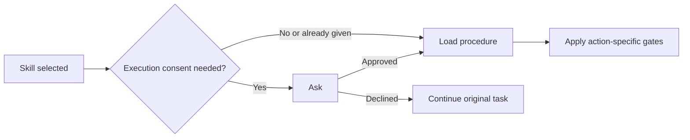

# Skill authoring conventions

Editable package-design rules consumed by 01-workflow-issue.md. Change these on
request; ordinary execution does not silently accumulate new rules or task diaries.

## Authoring baseline

Use SKILL.md with YAML frontmatter containing `name` (matching the directory) and
`description`. Describe when the skill applies and the outcome and boundaries it has.
Include instructions that change decisions or preserve non-obvious constraints.
Explain reasons instead of shouting-case MUST or NEVER. Correct observed failures
narrowly rather than adding universal rules.

Keep links relative and portable. Do not add scripts, dependencies, tests, or
additional documentation merely to make a skill appear substantial.

## Package layout and ownership

Keep cohesive work together. Split independently selected capabilities when useful;
a small single-purpose skill can remain entirely in SKILL.md. Supporting files
should improve selective reading or independent maintenance.

```text
skill-name/
├── SKILL.md                    purpose, discovery, routing
├── 01-workflow-<verb>.md        selected workflow, when separated
├── 02-<reference>.md           stable rules or supporting detail
├── catalogues/<subject>.md     independently maintained collections
├── scripts/                    executable helpers
└── agents/openai.yaml          harness metadata
```

These are optional parts, not a required scaffold.

| Content | Placement | Read or update route |
|---|---|---|
| Small cohesive procedure | SKILL.md | Direct invocation |
| Independently selected workflow | Numbered workflow file | Entry point selects it |
| Stable supporting rules | Numbered reference | Consuming step names it |
| Frequently edited knowledge | catalogues/ | Procedure reads it; knowledge edits route directly |
| Tooling or metadata | scripts/, agents/ | Relevant operation or harness |

Give every stable supporting file a two-digit index. Number sequences in execution
order; otherwise use entry-point reading order, default workflow first and references
last. List links in that order. Workflow files use `NN-workflow-<verb>.md`.
SKILL.md, scripts/, agents/, and growing catalogues retain unnumbered names.

The entry point links editable knowledge and explains its purpose. Its procedure
names when to read it. Knowledge edits route directly to the owning file without
running the procedure; update dependent instructions only when affected. Do not
silently add ordinary findings to catalogues. Use a structure suited to the contents:
for review criteria, include recognition signals, consequences, and exceptions,
rather than treating every signal as an automatic defect.

## Activation and consent

| Decision | Rule |
|---|---|
| Activation already settled | Preserve it |
| Activation unclear | Ask; recommend automatic applicability |
| Request-only | State the boundary and set target-harness metadata |
| Automatic | Omit request-only metadata |
| Execution consent required | Entry point asks before loading the procedure |
| Consent declined | Continue the original task without that capability; do not prompt again in the same scope |
| Later consequential action | Apply its own approval boundary |

State the selected activation policy in the proposal. Explicit invocation normally
satisfies activation consent for the requested capability, not unrelated actions.

For request-driven skills, state the request-only boundary in the instructions and
set the invocation metadata for each harness the skill targets:

- Claude Code and omp: `disable-model-invocation: true` in the frontmatter. omp
  normalizes this form, and the skill stays reachable through `/skill:<name>`.
- Codex: `agents/openai.yaml` containing the following. Explicit `$<name>`
  invocation still works. Preserve other fields if the file already exists, and
  create the file only for this purpose.

  ```yaml
  policy:
    allow_implicit_invocation: false
  ```

For automatically applicable skills, omit both. Verify enforcement where the harness
is available and report anything unverified. Never invent a metadata field and claim
it provides a working gate.



## Markdown format

Separate headings, paragraphs, lists, code blocks, and tables with blank lines.
For numbered lists with any wrapped item, put blank lines between all items;
one-line items may stay compact. This prevents renderers merging adjacent blocks.

## Workflow format

A workflow skill runs named steps that draw on other skills, usually with user
gates. Its body is both the overview of the run and its instructions. Use this
layout only when sequencing steps is the skill's job; other skills keep free-form
bodies.

```text
Opening and shared reading block
# Operations                 optional, for recurring actions
  ## <Verb>
# Steps                      or # Workflows routing to numbered files
  ## <Verb>
     Purpose
     Input / Output / Gate / Stop if, where applicable
     Ordered actions or prose
     ### Local template      when needed
---
Shared supporting sections  only when several steps consume them
```

Lay SKILL.md out in this order:

1. An opening: one line on what the skill does; if the skill also takes requests
   that are not a run, such as maintaining its catalogue, one line routing them to
   their file; then the reading block below, copied as is with its markers.

2. `# Operations`, if any: short actions named as verbs, such as `## Approve`.
   Define one only when it recurs across steps, workflows, or skills; anything
   used once stays in its step. A step runs an operation by writing its name in
   bold where it takes effect, in a sentence that says when.

3. `# Steps`, with one `## <Verb>` per step. Open each step with a one-line
   purpose, then the fields that apply:

   - **Input:** what the step consults or receives.
   - **Output:** what it leaves behind.
   - **Gate:** where the run pauses for the user; it continues from their answer.
     Name a recurring operation in bold, or state a one-use gate directly.
   - **Stop if:** what the agent may find that ends the run early.

   The body follows: the procedure, as numbered actions where the work has an
   order and as prose where it does not; prefer numbered actions. A body that
   starts with a bullet list opens with a lead-in line, so renderers keep it
   apart from the fields instead of merging the two lists. Branches that
   change the work without ending the run go in the body. Move long material,
   such as a template, into a `###` part and name it from the action that uses it.

4. If supporting sections follow, a horizontal rule (`---`, with a blank line
   before it), then those sections. A section belongs outside the steps only when
   several steps read it; otherwise its content stays in its step. A collection
   that grows goes in `catalogues/` instead (see Package layout and ownership).

A skill with several workflows puts `# Workflows` in SKILL.md in place of
`# Steps`: one line per workflow with its bold verb, its file, and when it
applies. Each `NN-workflow-<verb>.md` file holds a `# Steps` laid out as above,
without the reading block. It may open with a short paragraph saying when the
workflow applies and what it does not cover. Operations are defined only in
SKILL.md.
A step runs another workflow by its bold verb, as it runs an operation.

The reading block:

```markdown
<!-- workflow-instructions 6 -->
This is a workflow skill. Its steps are the `##` headings under `# Steps`. When
SKILL.md lists several workflows under `# Workflows`, read only the file of the
one that fits the request; its steps are the run. Work through the steps in
order; the user may redo, skip, or reorder them. When a step names another
section, file, or skill, read it then. A bold name, such as **Approve**, runs that
operation from `# Operations` or that workflow from `# Workflows`.
<!-- workflow-instructions end -->
```

- Name a section by its exact heading text, and keep every heading name unique in
  the file. Link a file relative to the skill folder.
- Name only model-invocable skills, by bare name.
- Read a skill that should shape the whole run in the first step.
- Workflow skills are usually request-only; set activation as above.
- The number in the opening marker versions the block. When you change the block,
  bump the number and replace every copy that
  `rg '<!-- workflow-instructions [0-9]' plugins/` reports with an older one.

When the skill needs execution consent (see Activation and consent), SKILL.md
holds only the gate. The layout above goes in `01-workflow-<verb>.md`, operations
included, which SKILL.md reads once consent is given, so nothing of the run is read
before the user agrees.

## Commit policy

After each completed and verified skill creation or modification, including changes
to procedures, conventions, or knowledge catalogues, create a commit in the skill's
Git repository. No additional commit confirmation is required.

Commit the coherent change, not every intermediate edit. Keep separate skill
changes in separate commits. Stage only changes belonging to that skill task.
Preserve unrelated working-tree and staged changes; never include them accidentally.
If pre-existing edits overlap the task, establish which changes are authorized
before including them.

Follow the repository's commit-message convention. Do not create empty commits.
If the destination is not a Git repository, changes cannot be safely isolated, or
committing fails, report the blocker rather than initializing a repository,
discarding changes, or claiming completion. Do not bypass failing hooks.
